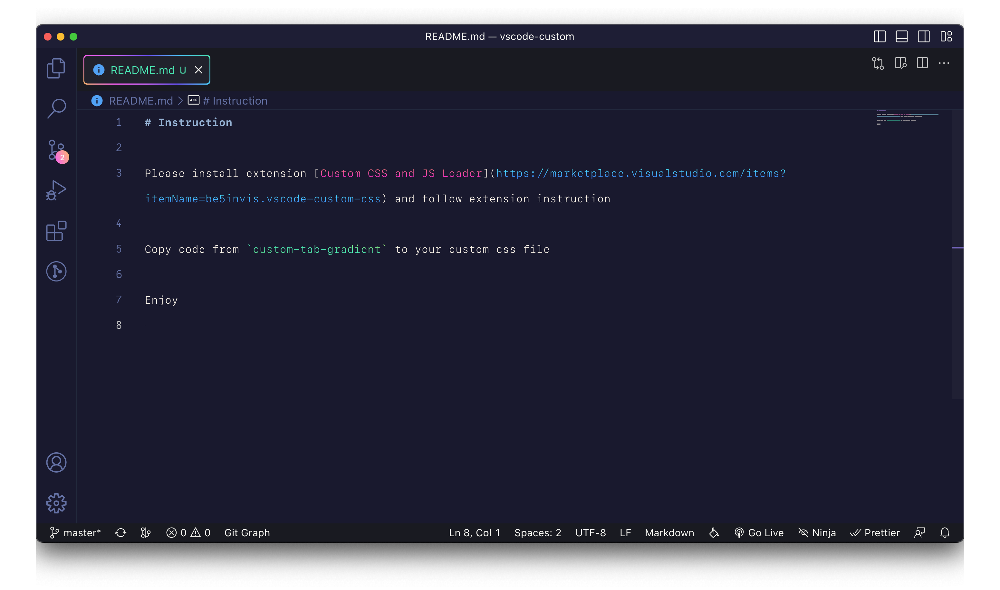
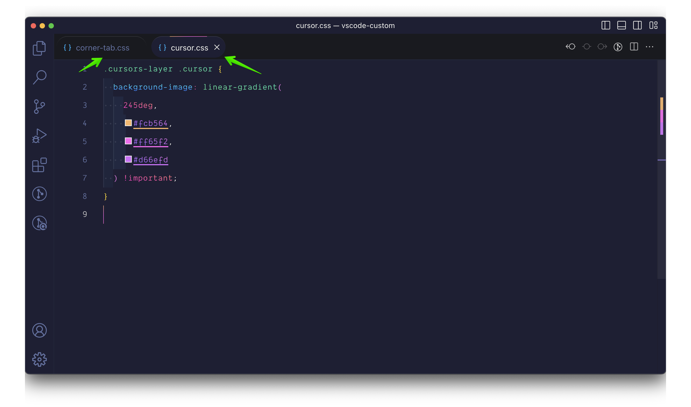

# README

## Preview

### Border gradient

### 4 corner

### rounded

## Instruction

Please install extension [Custom CSS and JS Loader](https://marketplace.visualstudio.com/items?itemName=be5invis.vscode-custom-css) and follow extension instruction

Copy code from my css files to your custom css file

Enjoy
